# LeanKG High Level Design

**Phien ban:** 1.3  
**Ngay:** 2026-03-25  
**Dua tren:** PRD v1.4  
**Trang thai:** Ban nhap  
**Changelog:** 
- v1.3 - Phase 2: Pipeline Information Extraction
  - Added Pipeline Parser component to Code Indexer
  - Added pipeline node types (pipeline, pipeline_stage, pipeline_step) to data model
  - Added pipeline relationship types (triggers, builds, depends_on)
  - Added Pipeline Indexing Flow (Section 3.5)
  - Added Pipeline Impact Analysis Flow (Section 3.6)
  - Added pipeline MCP tools and CLI commands
  - Updated C4 diagrams to include pipeline components
- v1.2 - Tech stack: Rust + SurrealDB
- v1.1 - Added impact radius analysis, TESTED_BY edges, review context, qualified names, auto-install MCP, per-project DB

---

## 1. Tổng quan kiến trúc

### 1.1 Design Principles

| Principle | Mô tả |
|-----------|-------|
| **Local-first** | Tất cả data và xử lý đều chạy local, không phụ thuộc cloud |
| **Single binary** | Ứng dụng được pack thành một file binary duy nhất |
| **Minimal dependencies** | Không yêu cầu external services như database processes |
| **Incremental** | Chỉ xử lý thay đổi, không scan lại toàn bộ |
| **MCP-native** | Thiết kế từ đầu cho MCP protocol |

### 1.2 System Overview

LeanKG là một local-first knowledge graph system cung cấp codebase intelligence cho AI coding tools. Hệ thống parse code, build dependency graph, và expose interface qua CLI và MCP server.

---

## 2. C4 Models

### 2.1 Context Diagram (C4-1)

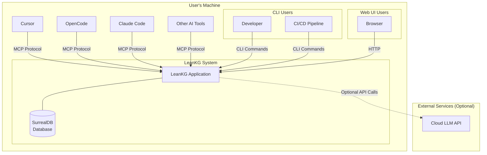

**Mô tả:**
- **LeanKG System:** Hệ thống chính chạy trên máy người dùng
- **AI Tools:** Cursor, OpenCode, Claude Code và các AI coding tools khác tương tác qua MCP protocol
- **Developer:** Sử dụng CLI để index, query, và generate documentation
- **CI/CD Pipeline:** Tự động hóa indexing trong quá trình build
- **Browser:** Truy cập lightweight web UI
- **Cloud LLM API:** Optional - cho future semantic search features

### 2.2 Container Diagram (C4-2)

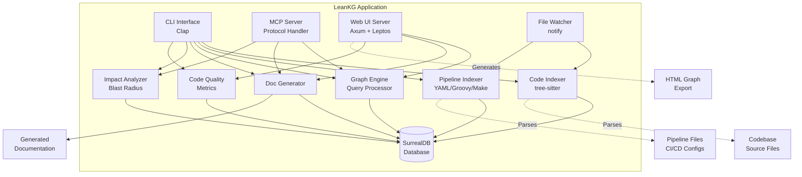

**Containers:**

| Container | Responsibility | Technology |
|-----------|---------------|------------|
| CLI Interface | Command-line interaction | Clap (Rust) |
| MCP Server | MCP protocol communication | Custom Rust implementation |
| Web UI Server | HTTP server for UI | Axum + Leptos (Rust) |
| Code Indexer | Parse source code with tree-sitter | tree-sitter (Rust) |
| Pipeline Indexer | Parse CI/CD configuration files | YAML/Groovy/Makefile parsers (Rust) |
| Graph Engine | Query and traverse knowledge graph | Rust |
| Doc Generator | Generate markdown documentation | Rust templates |
| File Watcher | Monitor file changes | notify (Rust) |
| Impact Analyzer | Calculate blast radius / impact radius | Rust (BFS traversal) |
| Code Quality | Detect large functions, code metrics | Rust |
| SurrealDB | Persistent storage (per-project) | SurrealDB (embedded) |

**Interactions:**

1. **CLI -> Indexer:** Developer chay lenh index
2. **CLI -> PipeIdx:** Developer chay lenh index (pipeline files auto-detected)
3. **CLI -> Graph:** Developer query knowledge graph
4. **CLI -> DocGen:** Developer generate documentation
5. **CLI -> Impact:** Developer calculate blast radius (includes pipeline impact)
6. **CLI -> Qual:** Developer check code quality metrics
7. **MCP -> Graph:** AI tools query code relationships
8. **MCP -> DocGen:** AI tools retrieve context
9. **MCP -> Impact:** AI tools calculate impact for changes (includes pipeline impact)
10. **Web -> Graph:** User browse graph trong browser
11. **Web -> Qual:** User view code quality metrics
12. **Indexer -> DB:** Store parsed code elements
13. **PipeIdx -> DB:** Store parsed pipeline elements and relationships
14. **Watcher -> Indexer:** Trigger re-index khi source files thay doi
15. **Watcher -> PipeIdx:** Trigger re-index khi pipeline files thay doi
16. **Web -> HTML:** Generate self-contained HTML graph export

### 2.3 Component Diagram (C4-3)

```mermaid
graph TB
    subgraph "Code Indexer"
        Parser[Parser Manager]
        GoParser[Go Parser]
        TSParser[TS/JS Parser]
        PyParser[Python Parser]
        Extractor[Entity Extractor]
        Builder[Graph Builder]
        
        Parser --> GoParser
        Parser --> TSParser
        Parser --> PyParser
        
        GoParser --> Extractor
        TSParser --> Extractor
        PyParser --> Extractor
        
        Extractor --> Builder
    end
    
    subgraph "Pipeline Indexer"
        PipeDetect[Pipeline Detector]
        GHAParser[GitHub Actions Parser]
        GLParser[GitLab CI Parser]
        JenkinsParser[Jenkinsfile Parser]
        MakeParser[Makefile Parser]
        DockerParser[Dockerfile Parser]
        PipeExtract[Pipeline Extractor]
        PipeBuilder[Pipeline Graph Builder]
        
        PipeDetect --> GHAParser
        PipeDetect --> GLParser
        PipeDetect --> JenkinsParser
        PipeDetect --> MakeParser
        PipeDetect --> DockerParser
        
        GHAParser --> PipeExtract
        GLParser --> PipeExtract
        JenkinsParser --> PipeExtract
        MakeParser --> PipeExtract
        DockerParser --> PipeExtract
        
        PipeExtract --> PipeBuilder
    end
    
    subgraph "Graph Engine"
        Query[Query Processor]
        Search[Search Engine]
        Relate[Relationship Engine]
        Cache[Query Cache]
        
        Query --> Search
        Query --> Relate
        Search --> Cache
        Relate --> Cache
    end
    
    subgraph "Impact Analyzer"
        BFS[BFS Traversal]
        Radius[Radius Calculator]
        Context[Review Context<br/>Generator]
        PipeImpact[Pipeline Impact<br/>Calculator]
        
        BFS --> Radius
        Radius --> Context
        Radius --> PipeImpact
    end
    
    subgraph "Code Quality"
        Metrics[Metrics Collector]
        LargeFunc[Large Function<br/>Detector]
        Fanout[High Fan-out<br/>Detector]
        
        Metrics --> LargeFunc
        Metrics --> Fanout
    end
    
    subgraph "Doc Generator"
        Template[Template Engine]
        Renderer[Markdown Renderer]
        Format[Formatter]
        Sync[Doc Sync Manager]
        
        Template --> Renderer
        Renderer --> Format
        Format --> Sync
    end
    
    subgraph "MCP Server"
        Protocol[MCP Protocol]
        Handler[Request Handler]
        Tools[Tool Registry]
        Auth[Auth Manager]
        Install[MCP Config<br/>Installer]
        
        Protocol --> Handler
        Handler --> Tools
        Handler --> Auth
        Handler --> Install
    end
    
    Builder -->|Writes| DB[(SurrealDB)]
    PipeBuilder -->|Writes| DB
    Query -.->|Reads| DB
    Sync -.->|Reads| DB
    Tools -.->|Queries| Graph
    BFS -.->|Reads| DB
    Context -.->|Reads| DB
    PipeImpact -.->|Reads| DB
    Metrics -.->|Reads| DB
```

**Components:**

| Component | Responsibility |
|-----------|----------------|
| Parser Manager | Language detection va parser delegation |
| Go Parser | Parse Go source files |
| TS/JS Parser | Parse TypeScript/JavaScript files |
| Python Parser | Parse Python files |
| Entity Extractor | Extract functions, classes, imports, TESTED_BY |
| Graph Builder | Build relationships va store to DB |
| Pipeline Detector | Auto-detect CI/CD config files by path and naming convention |
| GitHub Actions Parser | Parse `.github/workflows/*.yml` files |
| GitLab CI Parser | Parse `.gitlab-ci.yml` files |
| Jenkinsfile Parser | Parse Jenkinsfile (declarative/scripted) |
| Makefile Parser | Parse Makefile targets and dependencies |
| Dockerfile Parser | Parse Dockerfile and docker-compose.yml |
| Pipeline Extractor | Extract pipeline stages, steps, triggers, artifacts from parsed AST |
| Pipeline Graph Builder | Build pipeline nodes and relationships (triggers, builds, depends_on) |
| Query Processor | Process user queries |
| Search Engine | Search code elements |
| Relationship Engine | Traverse graph relationships |
| Query Cache | Cache frequent queries |
| BFS Traversal | Breadth-first search for blast radius |
| Radius Calculator | Calculate impact radius in N hops |
| Review Context Generator | Generate focused subgraph + prompt |
| Pipeline Impact Calculator | Extend blast radius to include affected pipelines and deployment targets |
| Metrics Collector | Collect code quality metrics |
| Large Function Detector | Find oversized functions |
| High Fan-out Detector | Find functions with many dependencies |
| Template Engine | Load documentation templates |
| Markdown Renderer | Render markdown output |
| Formatter | Format documentation |
| Doc Sync Manager | Sync docs voi code changes |
| MCP Protocol | Handle MCP protocol messages |
| Request Handler | Route requests to appropriate tools |
| Tool Registry | Register available MCP tools |
| Auth Manager | Authenticate MCP connections |
| MCP Config Installer | Auto-generate .mcp.json for AI tools |

### 2.4 Deployment Diagram (C4-4)

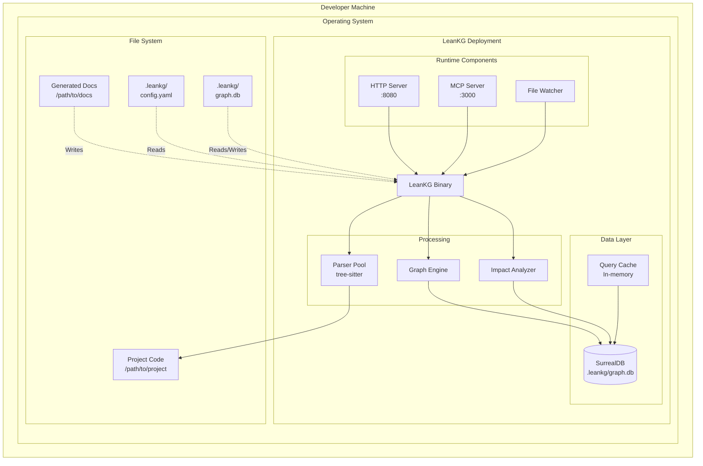

**Deployment Scenarios:**

| Scenario | Environment | Resources |
|----------|--------------|------------|
| macOS Intel | macOS x64 | < 100MB RAM, < 200MB disk |
| macOS Apple Silicon | macOS ARM64 | < 100MB RAM, < 200MB disk |
| Linux x64 | Linux x64 | < 100MB RAM, < 200MB disk |
| Linux ARM64 | Linux ARM64 | < 100MB RAM, < 200MB disk |

**Database Location:** Per-project at `.leankg/graph.db` (gitignored, portable with project)

**Processes:**

| Process | Port | Description |
|---------|------|-------------|
| LeanKG Binary | - | Main application process |
| HTTP Server | 8080 | Web UI server (optional) |
| MCP Server | 3000 | MCP protocol endpoint |
| File Watcher | - | Background notify process |
| SurrealDB | - | Embedded in-process database |

---

## 3. Data Flow

### 3.1 Indexing Flow

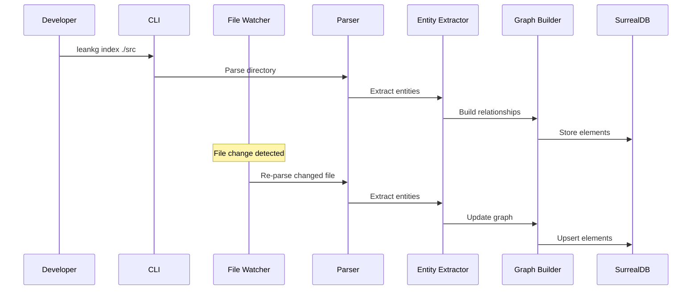

### 3.2 Query Flow

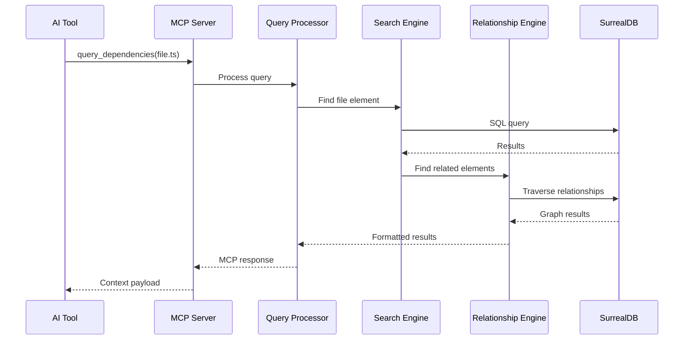

### 3.3 Documentation Generation Flow

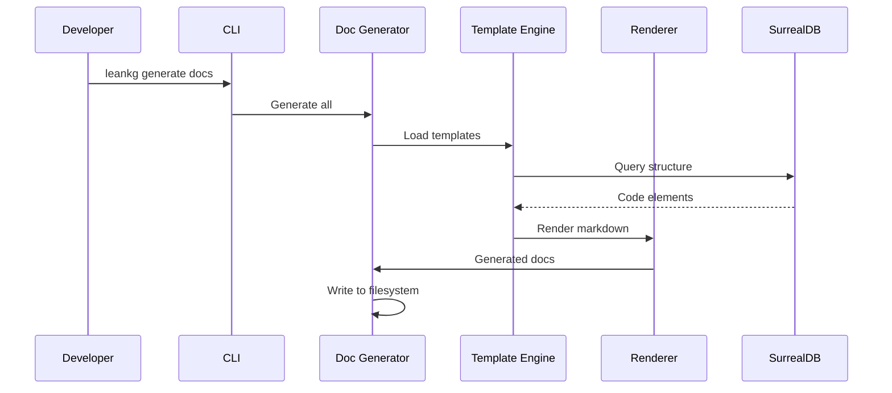

### 3.4 Impact Analysis Flow

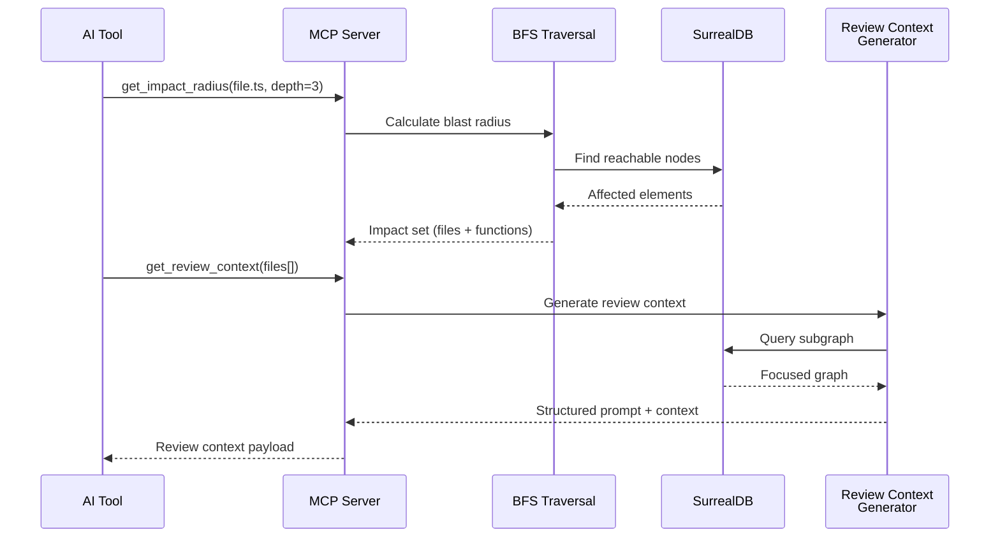

### 3.5 Pipeline Indexing Flow (Phase 2)

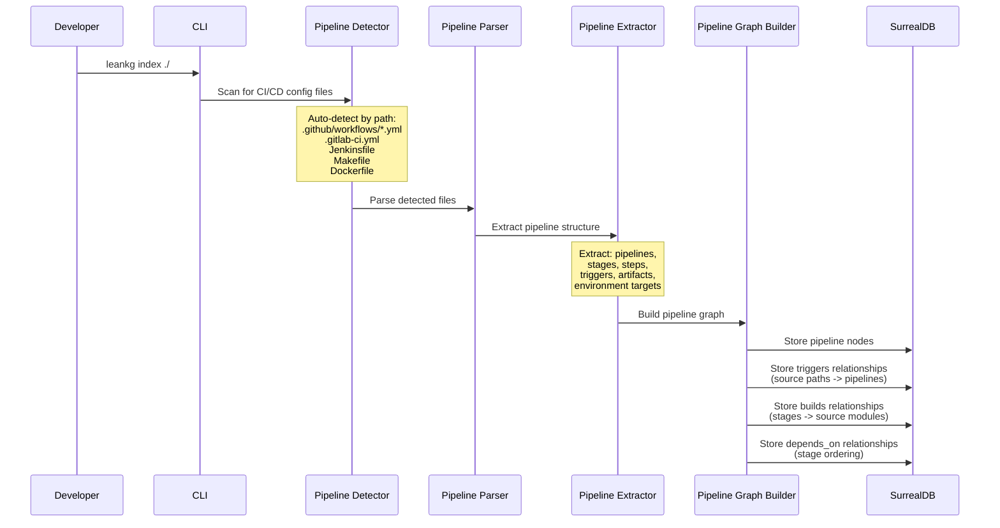

### 3.6 Pipeline Impact Analysis Flow (Phase 2)

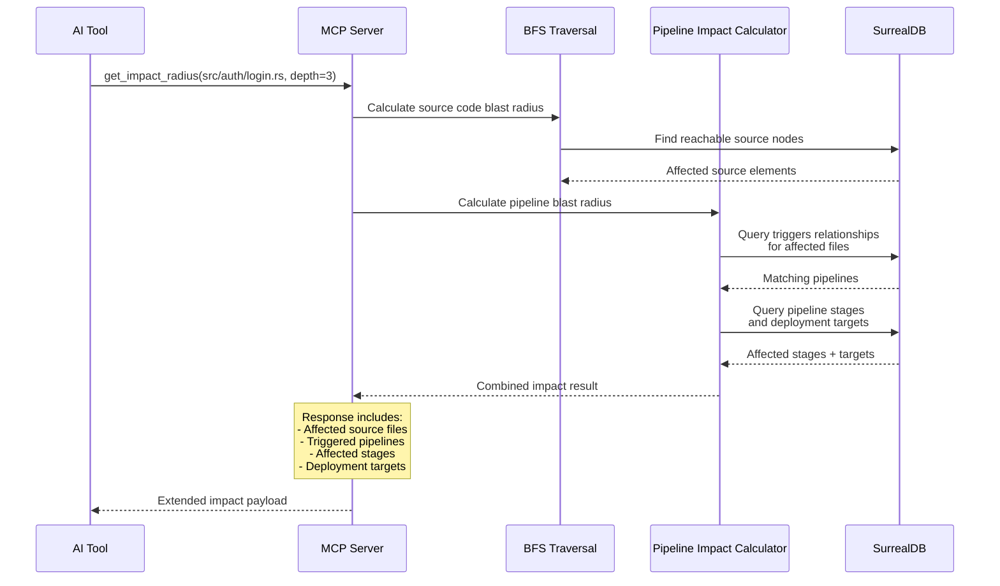

---

## 4. Data Model

### 4.1 Entity Relationship Diagram

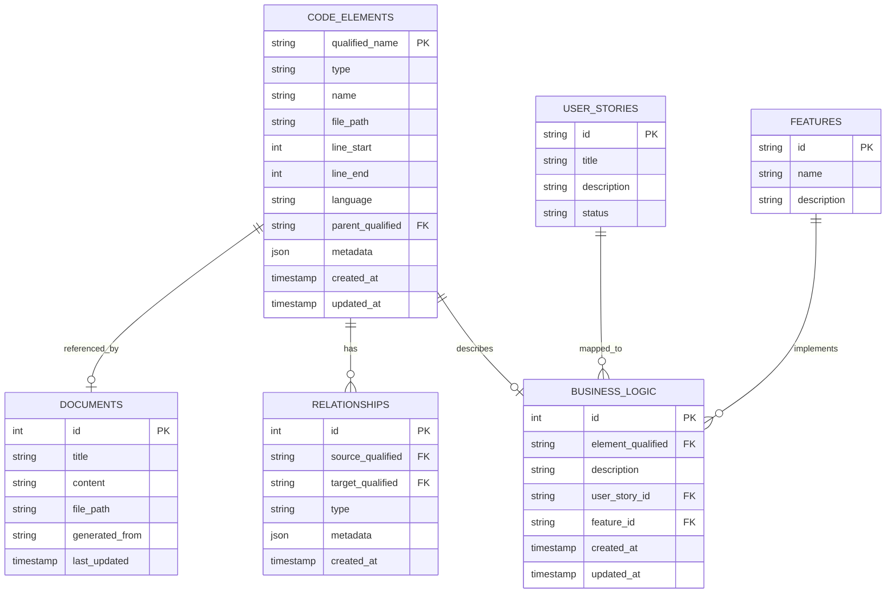

### 4.2 Schema Description

| Table | Mo ta |
|-------|-------|
| CODE_ELEMENTS | Luu tru tat ca code elements (files, functions, classes, imports, exports) va pipeline elements (pipelines, stages, steps). PK = qualified_name (`file_path::parent::name`) |
| RELATIONSHIPS | Quan he giua cac elements: source code (imports, calls, implements, contains, tested_by) va pipeline (triggers, builds, depends_on) |
| BUSINESS_LOGIC | Annotations mo ta business logic cua tung element |
| DOCUMENTS | Generated documentation files |
| USER_STORIES | User stories duoc map voi code |
| FEATURES | Features duoc map voi code |

### 4.3 Pipeline-Specific Node Types (Phase 2)

| Element Type | qualified_name Format | Description | Metadata Fields |
|-------------|----------------------|-------------|-----------------|
| `pipeline` | `file_path::pipeline_name` | A CI/CD workflow/pipeline definition | `{ci_platform, trigger_events, branches}` |
| `pipeline_stage` | `file_path::pipeline_name::stage_name` | A stage/job within a pipeline | `{runner, environment, condition, timeout}` |
| `pipeline_step` | `file_path::pipeline_name::stage_name::step_name` | An individual step within a stage | `{command, image, artifact_paths}` |

### 4.4 Pipeline-Specific Relationship Types (Phase 2)

| Relationship | Source | Target | Description | Metadata |
|-------------|--------|--------|-------------|----------|
| `triggers` | `file` (source path pattern) | `pipeline` | Source file changes trigger this pipeline | `{event_type, branch_filter, path_filter}` |
| `builds` | `pipeline_stage` | `file` (source module) | Pipeline stage builds/tests this module | `{build_command, test_command}` |
| `depends_on` | `pipeline_stage` | `pipeline_stage` | Stage execution ordering | `{condition, artifact_dependency}` |
| `deploys_to` | `pipeline_stage` | (environment name in metadata) | Stage deploys to an environment | `{environment, strategy, region}` |

---

## 5. Interface Specifications

### 5.1 CLI Commands

| Command | Description |
|---------|-------------|
| `leankg init` | Initialize new LeanKG project in .leankg/ |
| `leankg index [path]` | Index codebase |
| `leankg query <query>` | Query knowledge graph |
| `leankg generate docs` | Generate documentation |
| `leankg annotate` | Add business logic annotations |
| `leankg serve` | Start MCP server và/hoặc web UI |
| `leankg status` | Show index status |
| `leankg watch` | Start file watcher |
| `leankg impact <file> [depth]` | Calculate blast radius for file |
| `leankg install` | Auto-generate MCP config for AI tools |
| `leankg export` | Export graph as self-contained HTML |
| `leankg quality` | Show code quality metrics (large functions) |
| `leankg pipeline [file]` | Show pipelines affected by a file change (Phase 2) |
| `leankg pipeline --list` | List all indexed pipelines and their stages (Phase 2) |

### 5.2 MCP Tools

| Tool | Description |
|------|-------------|
| `query_file` | Find file by name or pattern |
| `get_dependencies` | Get file dependencies (direct imports) |
| `get_dependents` | Get files depending on target |
| `get_impact_radius` | Get all files affected by change within N hops |
| `get_review_context` | Generate focused subgraph + structured review prompt |
| `find_function` | Locate function definition |
| `get_call_graph` | Get function call chain (full depth) |
| `search_code` | Search code elements by name/type |
| `get_context` | Get AI context for file (minimal, token-optimized) |
| `generate_doc` | Generate documentation for file |
| `find_large_functions` | Find oversized functions by line count |
| `get_tested_by` | Get test coverage for a function/file |
| `get_pipeline_for_file` | Get pipelines triggered by changes to a file (Phase 2) |
| `get_pipeline_stages` | List all stages/jobs in a pipeline with their steps (Phase 2) |
| `get_deployment_targets` | Get environments/targets a file change can reach (Phase 2) |

### 5.3 Web UI Routes

| Route | Description |
|-------|-------------|
| `/` | Main dashboard |
| `/graph` | Interactive graph visualization |
| `/browse` | Code browser |
| `/docs` | Documentation viewer |
| `/annotate` | Business logic annotation |
| `/quality` | Code quality metrics |
| `/export` | Generate self-contained HTML graph |
| `/settings` | Configuration |

---

## 6. Security Considerations

### 6.1 Local Security

| Concern | Mitigation |
|---------|------------|
| Data at rest | Database file stored locally with optional encryption |
| MCP authentication | Local token-based authentication |
| File access | Sandboxed to project directory |

### 6.2 Network Security

| Concern | Mitigation |
|---------|------------|
| HTTP exposure | Bind to localhost only by default |
| MCP exposure | Local socket or localhost binding |
| External APIs | Optional, user-controlled |

---

## 7. Performance Targets

| Operation | Target | Notes |
|-----------|--------|-------|
| Cold start | < 2s | Binary initialization |
| Index speed | > 10K LOC/s | Per language parser |
| Query latency | < 100ms | Graph queries |
| Memory idle | < 100MB | No active operations |
| Memory peak | < 500MB | During indexing |
| Disk footprint | < 50MB/100K LOC | Database size |

---

## 8. Configuration

### 8.1 Project Configuration (leankg.yaml)

```yaml
project:
  name: my-project
  root: ./src
  languages:
    - go
    - typescript
    - python

indexer:
  exclude:
    - "**/node_modules/**"
    - "**/vendor/**"
    - "**/*.test.go"
  include:
    - "*.go"
    - "*.ts"
    - "*.py"

pipeline:
  enabled: true
  auto_detect: true
  formats:
    - github_actions
    - gitlab_ci
    - jenkinsfile
    - makefile
    - dockerfile
  custom_paths: []

mcp:
  enabled: true
  port: 3000
  auth_token: generated

web:
  enabled: true
  port: 8080

documentation:
  output: ./docs
  templates:
    - agents
    - claude
```

---

## 9. Error Handling

### 9.1 Error Categories

| Category | Handling | User Feedback |
|----------|----------|---------------|
| Parse errors | Skip file, log warning | Warning in CLI output |
| Database errors | Retry with backoff | Error message |
| MCP errors | Return error response | MCP error payload |
| File system errors | Graceful degradation | Warning |

### 9.2 Logging

- **Level:** Configurable (debug, info, warn, error)
- **Output:** STDERR by default, file option available
- **Format:** Structured JSON for machine parsing, text for human

---

## 10. Future Considerations

### 10.1 Phase 2 Features

- Pipeline information extraction (US-09)
  - Pipeline Detector: auto-detect CI/CD config files by path convention
  - Pipeline Parsers: GitHub Actions (YAML), GitLab CI (YAML), Jenkinsfile (Groovy), Makefile, Dockerfile
  - Pipeline Graph Builder: create pipeline/stage/step nodes and triggers/builds/depends_on edges
  - Pipeline Impact Calculator: extend blast radius to include pipeline and deployment targets
  - Pipeline MCP tools: get_pipeline_for_file, get_pipeline_stages, get_deployment_targets
  - Pipeline CLI commands: leankg pipeline
  - Pipeline context in auto-generated docs
- Web UI improvements
- Business logic annotations
- Additional language support (Rust, Java, C#)
- Incremental indexing optimization

### 10.2 Phase 3 Features

- Vector embeddings cho semantic search
- Cloud sync option
- Team features (shared knowledge graphs)
- Plugin system

---

## 11. Dependencies

### 11.1 Direct Dependencies (Rust + SurrealDB)

| Dependency | Version | Purpose |
|------------|---------|---------|
| surrealdb | latest | Embedded multi-model graph database |
| tree-sitter | latest | Code parsing |
| clap | latest | CLI framework |
| notify | latest | File watching |
| axum | latest | Web server |
| mcp-protocol | latest | MCP server implementation |

### 11.2 Build Dependencies

| Dependency | Version | Purpose |
|------------|---------|---------|
| Rust | 1.75+ | Build toolchain |
| tree-sitter parsers | bundled | Language support (Go, TS, Python, Rust, etc.) |

---

## 12. Appendix

### 12.1 Glossary

| Term | Definition |
|------|------------|
| Container | Executable process in C4 model |
| Component | Internal module của container |
| Code element | File, function, class, import trong codebase |
| Context | Information provided to AI tool |
| Blast radius | Files affected by a change |
| Impact radius | Same as blast radius - BFS traversal within N hops |
| Qualified name | Natural node identifier: `file_path::parent::name` |
| TESTED_BY | Relationship type: test file tests production code |
| Pipeline | A CI/CD workflow definition parsed into the knowledge graph as a node |
| Pipeline Stage | A named phase within a pipeline (build, test, deploy) stored as a graph node |
| Pipeline Step | An individual action within a stage stored as a graph node |
| Trigger | Relationship linking source file path patterns to pipeline definitions |
| Pipeline Blast Radius | Extension of impact analysis to include affected pipelines and deployment targets |

### 12.2 References

- C4 Model: https://c4model.com/
- SurrealDB: https://github.com/surrealdb/surrealdb (Embedded multi-model graph database)
- tree-sitter: https://tree-sitter.github.io/tree-sitter/
- MCP Protocol: https://modelcontextprotocol.io/
- code-review-graph: https://github.com/tirth8205/code-review-graph (inspiration for impact analysis)